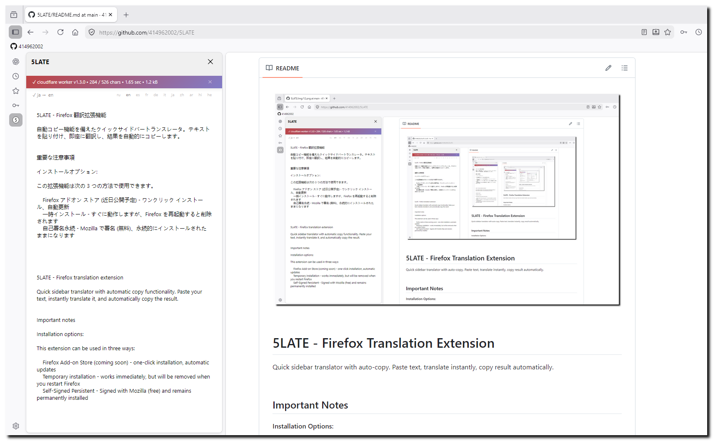

<br clear="all">

# 5LATE - Firefox Translation Extension

Quick sidebar translator with auto-copy. Paste text, translate instantly, copy result automatically.

&nbsp;

## Important Notes

**Installation Options:**

This extension can be used in three ways:

1. **Firefox Add-ons Store** (Coming soon) - One-click install, automatic updates
2. **Temporary Installation** - Works immediately but removed on Firefox restart
3. **Self-Signed Permanent** - Sign with Mozilla (free), stays installed permanently

**For developers/advanced users:**

- Temporary installation is quick for testing but resets every Firefox restart
- For permanent use, you must sign the extension with Mozilla (takes 5-10 minutes, free)
- Firefox blocks unsigned extensions for security reasons

See installation instructions below for details.

&nbsp;

---

&nbsp;

## Features

- Auto translation after 1.5 seconds
- Auto language detection (11 languages)
- Smart EN↔RU auto-swap
- Single-word dictionary disambiguation (Cyrillic ↔ Latin)
- Auto-copy to clipboard
- Sidebar mode (persistent state)
- Tab mode (temporary session)
- Direct-to-Google translation — no server proxy, nothing to deploy or maintain

&nbsp;

## Installation

### Option 1: Firefox Add-ons Store (Recommended)


### Click & Use Signed Extension

[5late-1.3.0.xpi](https://github.com/414962002/5SLATE/releases/download/v1.3.0/65f33d6a9f6b4a9d91b7-1.3.0.xpi)

&nbsp;

### Option 2: Temporary Installation (Quick Testing)

**Best for:** Testing, development, short-term use

**Limitations:** Extension is removed when Firefox restarts

**Steps:**

**Step 1: Download**

Clone or download this repository.

&nbsp;

**Step 2: Open Firefox**

Go to `about:debugging#/runtime/this-firefox`

&nbsp;

**Step 3: Load Extension**

1. Click "Load Temporary Add-on"
2. Navigate to this folder
3. Select `manifest.json`
4. Extension is now loaded

&nbsp;

**Step 4: Open Sidebar**

Click the extension icon in Firefox toolbar.

&nbsp;

**Note:** You must reload the extension every time Firefox restarts.

&nbsp;

### Option 3: Permanent Installation (Self-Signed)

**Best for:** Daily use, permanent installation

**Requirements:** Mozilla account (free)

**Steps:**

**Step 1: Download and Prepare**

1. Download this repository
2. Zip the contents of this folder (manifest.json, sidebar.js, etc.)
3. Make sure all files are in the root of the zip (not in a subfolder)

&nbsp;

**Step 2: Sign with Mozilla**

1. Create account: https://addons.mozilla.org/developers/
2. Go to: https://addons.mozilla.org/developers/addon/submit/distribution
3. Choose "On your own" (self-distribution) — or submit for the public AMO listing
4. Upload your .zip file
5. Mozilla validates and signs (5-10 minutes)
6. Download the signed .xpi file

&nbsp;

**Step 3: Install Signed Extension**

1. Firefox → `about:addons`
2. Click gear icon → "Install Add-on From File"
3. Select the signed .xpi file
4. Confirm installation

&nbsp;

**Step 4: Open Sidebar**

Click the extension icon in Firefox toolbar.

&nbsp;

**Note:** Extension stays installed permanently, survives Firefox restart.

&nbsp;

## Usage

1. Click extension icon to open sidebar
2. Paste text into input field
3. Wait 1.5 seconds (auto-translate)
4. Translation auto-copied to clipboard
5. Paste anywhere (Ctrl+V)

&nbsp;

## Supported Languages

Russian, English, Spanish, French, German, Italian, Japanese, Chinese, Arabic, Hindi, Hebrew

&nbsp;

## Architecture

```
Extension → Google Translate (direct)
```

**Fallback system:**

1. Direct → Google GTX (single-word queries get a disambiguation hint instead of plain auto-detect)
2. Direct → Google clients5 (used only if GTX fails)

No server-side proxy. Earlier versions (≤1.3.0) routed translation through a
Cloudflare Worker, on the theory that Google blocks browser-origin requests
more than server-to-server ones. Weeks of production logs showed the
opposite: the Worker's shared Cloudflare IP got throttled/CAPTCHA'd more
often than this browser's own connection. The Worker was removed in 1.4.0;
the one feature it added — single-word dictionary disambiguation — was
ported directly into the extension (`buildGtxQuery()` in `sidebar.js`).

&nbsp;

## Privacy & Security

- No accounts, no tracking, no analytics
- No server-side component — every translation request goes straight from
  your browser to Google's translation endpoints
- Permissions requested: `translate.googleapis.com` and `clients5.google.com`
  (the two translation endpoints), `clipboardWrite` (auto-copy results), and
  `storage` (persist sidebar state locally)
- No data leaves your machine except the text being translated, sent
  directly to Google
- Open source (auditable code)

&nbsp;

## License

Open source. *(No LICENSE file is included in this repository yet — treat as
all-rights-reserved until one is added.)*

&nbsp;

---

**Version:** 1.4.0
**Status:** Production Ready ✅
